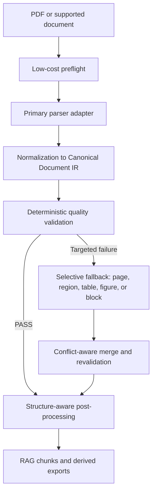
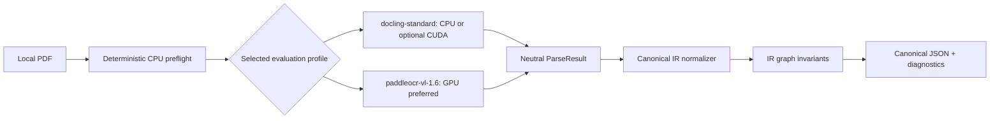

# Enterprise Document Parsing & RAG Ingestion Platform

[English](README.md) | [简体中文](README.zh-CN.md)

A production-oriented foundation for converting complex documents into a versioned,
traceable, parser-independent representation suitable for downstream RAG ingestion.

> Project status: Phases 0–2.6 are implemented. `docling-standard` remains the baseline and the
> complete PaddleOCR-VL-1.6 pipeline is an optional GPU-first comparison candidate. Native PDF
> evidence and benchmark infrastructure make accuracy measurable once an approved benchmark
> corpus is supplied. This is still
> development/evaluation quality, not a production service or a 95% accuracy claim.

## What this project is

The target platform accepts born-digital, scanned, Chinese, English, and bilingual documents,
then recovers text, layout, reading order, tables, figures, equations, document structure, and
source provenance. Its primary output is not Markdown. It is a stable Canonical Document IR from
which JSON, Markdown, HTML, RAG chunks, citations, and viewer highlights can be derived.

The intended production pipeline is:



Normal documents will run through one primary parser. Fallback is scoped to failed entities or
pages instead of reparsing every document with multiple models.

## Current implementation

The repository provides the Canonical IR domain layer plus one deliberately narrow real-parser
vertical slice:

- Strict Pydantic v2 models with `extra="forbid"` and strict wire validation.
- Draft 2020-12 JSON Schema generated deterministically from the Pydantic models.
- Lowercase, type-prefixed opaque IDs with UUIDv5/UUIDv7 version enforcement.
- Canonical top-left PDF-point geometry, bounded coordinate precision, rotation, and reversible
  affine transforms.
- `DocumentIR`, pages, blocks, Unicode text spans, processing metadata, and provenance lineage.
- Sections, logical and cross-page tables, merged cells, cell fragments, figures, equations,
  references, relationships, and chunk wire entities.
- Document-level referential, topology, reading-order, table-grid, and provenance invariants.
- Deterministic UTF-8/NFC serialization, semantic digests, and optional block fingerprints.
- A minimal deterministic and idempotent IR migration registry.
- Monolithic and sharded IR packaging manifest models.
- Offline unit, schema, property-based, golden-vector, and CLI regression tests.
- A strict parser-neutral `DocumentParser`/`ParseResult` contract; Canonical and application layers
  do not import Docling types.
- Deterministic CPU-only PDF preflight preserving native page text, numeric tokens, actual
  MediaBox/CropBox, rotation, extraction status and cheap structural/image signals.
- An optional, exactly pinned Docling `2.123.0` adapter with explicit CPU/CUDA/auto behavior.
- An optional full PaddleOCR-VL-1.6 pipeline (`paddleocr==3.7.0`, `paddlex==3.7.1`,
  PaddlePaddle `3.3.0`) using PP-DocLayoutV3 plus the 1.6 VLM.
- Mapping of Docling text/layout, reading order, tables/cells/spans, figures/captions and basic
  equations into existing Canonical IR entities without flattening tables.
- Fact-only parsing diagnostics plus `parse-local`, `parse-robust`, and `benchmark-parsing`
  commands. Benchmark
  output keeps text, tables, reading order, numerics, provenance and latency independent; it
  deliberately has no global parser score.
- A discrete Quality Gate (`ACCEPT`, `FALLBACK_REQUIRED`, `REJECT`) with hard-integrity reuse,
  completeness, numeric-multiset, reading-order, and table-degeneracy evidence rules.
- Versioned calibration profiles and DOCUMENT/PAGE/TABLE calibration reports; without a frozen
  real-corpus profile the runtime is explicitly `OBSERVE_ONLY` and non-publishable.
- One-round selective fallback using one-page PDF materialization, atomic PAGE or single-page
  TABLE replacement, copy-on-write revisions, fallback provenance, and full revalidation.

The real-document development flow is:



## Not implemented yet

The following remain architecture contracts and implementation-plan items, not working features:

- Local/S3 artifact storage and SQLite/PostgreSQL job persistence.
- Parser workers, GPU scheduling, checkpoint/resume, queues, and distributed execution.
- A calibrated production Quality Gate profile: no approved calibration corpus has been supplied,
  so no reliability or 95% claim is valid and automatic routing stays disabled by default.
- Cross-page table fallback, region/block fallback, and general graph reconciliation.
- MinerU, Marker, or Surya adapters. Paddle remains an evidence-gated alternate candidate, not an
  unconditional primary or fallback.
- Semantic chunk construction, token packing, embedding, retrieval, and reranking.
- FastAPI service, upload endpoints, Prometheus, OpenTelemetry, and Grafana integration.

The Docling adapter has explicitly labeled synthetic-contract coverage and an opt-in real CPU smoke test. Default CI
does not install Docling, download models, use a GPU, or access the network. Security admission and
parser sandboxing are also not implemented, so do not process untrusted uploads with this slice.

Configuration values naming fallback parsers or storage backends remain validated declarations.
The `doctor` command validates configuration only; it does not load Docling, probe CUDA, or create
storage resources.

## Core design principles

1. **Parser independence** — all parsers will sit behind adapters; canonical models never import a
   parser SDK or expose parser-private object types.
2. **Canonical IR first** — structured, versioned IR is the source of truth; Markdown and RAG
   chunks are derived views.
3. **Provenance first** — content remains traceable through chunk, entity, block, page, geometry,
   artifact, and parser run.
4. **Quality-aware routing** — parser execution success is distinct from parse-quality acceptance.
5. **Selective fallback** — only failed pages or entities are eligible for fallback by default.
6. **Deterministic where possible** — schema validation, geometry, structural checks, hashing, and
   routing evidence do not require an LLM.
7. **Simple first, scalable by design** — the first deployment target is one Linux machine and one
   NVIDIA GPU; scale adapters are introduced only after measured triggers.

## Canonical Document IR

The logical IR 1.0 graph is:

```text
DocumentIR
├── source and metadata
├── processing manifest
├── pages[]
│   └── blocks[]
│       └── text_spans[]
├── sections[]
├── tables[]
│   ├── segments[]
│   └── cells[]
│       └── fragments[]
├── figures[]
├── equations[]
├── references[]
├── chunks[]
├── relationships[]
├── provenance[]
└── quality_summary
```

Important wire guarantees include:

- Current writer Schema version `1.2.0`; deterministic readers migrate supported `1.0.0` and
  `1.1.0` payloads.
- Before quality validation, `quality_summary` is explicitly `NOT_EVALUATED` with no fabricated
  score or report ID and is not publishable.
- UTF-8 and Unicode NFC without destructive retrieval normalization.
- RFC 3339 UTC timestamps serialized with `Z`.
- Digests formatted as `sha256:<64 lowercase hex>`.
- Confidence represented as `null` or a value in `[0, 1]`; unknown is never coerced to `1.0`.
- Page coordinates use top-left origin, x-right, y-down, and PDF points (`1/72 inch`).
- Published content requires resolvable provenance.
- Page cardinality, reading order, graph references, table grids, and section topology are hard
  domain invariants.
- Namespaced and bounded extensions cannot replace canonical semantics or contain arbitrary raw
  parser output.

See [DOCUMENT_IR_SPEC.md](docs/DOCUMENT_IR_SPEC.md) for the authoritative contract and
[document-ir.schema.json](schemas/document-ir/v1/document-ir.schema.json) for the generated wire
schema.

## Requirements

- Python 3.12+
- PowerShell examples below assume Windows; equivalent Python commands work on Linux/macOS.
- The core install and default tests require no GPU, model download, database, or network access.
- Real Docling and Paddle parsing are optional extras. Docling supports CPU; CUDA accelerates
  model-assisted stages. Paddle is benchmarked on CUDA and remains outside the core install.

## Reproducible installation

### Windows PowerShell

```powershell
python -m venv .venv
.\.venv\Scripts\python.exe -m pip install --upgrade pip
.\.venv\Scripts\python.exe -m pip install -r requirements.lock
.\.venv\Scripts\python.exe -m pip install --no-build-isolation --no-deps -e .
```

### Linux or macOS

```bash
python3.12 -m venv .venv
.venv/bin/python -m pip install --upgrade pip
.venv/bin/python -m pip install -r requirements.lock
.venv/bin/python -m pip install --no-build-isolation --no-deps -e .
```

All direct and transitive dependencies used by the current phase are pinned in
[`requirements.lock`](requirements.lock). The core includes only the small deterministic PDF
preflight dependency. Docling and its model stack are not installed by the core command.

### Optional Docling parser

Install the exact adapter dependency only on machines that will perform real parsing:

```powershell
.\.venv\Scripts\python.exe -m pip install --no-build-isolation -e ".[docling]"
```

The `docling-standard` profile fixes Docling `2.123.0`, RapidOCR `ch` on the Torch backend,
accurate TableFormer with cell matching, local formula/code enrichment, and page batch size one.
The first real run can acquire model assets according to Docling's cache behavior; review and
approve every model license before production promotion.

### Optional PaddleOCR-VL-1.6 candidate

Use an isolated environment. Install the exact optional client/pipeline dependencies, then install
the official PaddlePaddle `3.3.0` CPU or GPU wheel matching the host CUDA runtime:

```powershell
.\.venv\Scripts\python.exe -m pip install --no-build-isolation -e ".[paddleocr-vl]"
# Install paddlepaddle-gpu==3.3.0 from the official Paddle wheel index for your CUDA version.
```

The profile is the complete `PaddleOCR-VL-1.6` document pipeline: PP-DocLayoutV3, region
cropping/ordering and `PaddleOCR-VL-1.6-0.9B`. It is not the bare VLM. Explicit `--device cuda`
fails when the pinned GPU runtime is unavailable; the core domain contains no CUDA imports.

## Quick verification

```powershell
.\.venv\Scripts\docparser.exe --version
.\.venv\Scripts\docparser.exe doctor --config configs/default.yaml
.\.venv\Scripts\docparser.exe schema check
.\.venv\Scripts\docparser.exe parse-local --help
.\.venv\Scripts\docparser.exe parse-robust --help
.\.venv\Scripts\docparser.exe benchmark-parsing --help
.\.venv\Scripts\docparser.exe prepare-parsebench-manifests --help
```

Expected command responsibilities:

- `--version` prints the package version.
- `doctor` validates the bootstrap YAML contract without creating paths, opening a database,
  loading a parser, or using the network.
- `schema check` fails if the committed JSON Schema differs from the Pydantic-generated contract.
- `parse-local` exposes the optional local-PDF development path.
- `parse-robust` runs parse, Quality Gate, optional evidence-gated PAGE/TABLE fallback, full
  revalidation, and final IR emission. Without frozen profiles it reports
  `OBSERVE_ONLY / CALIBRATION_REQUIRED` and does not execute automatic fallback.
- `prepare-parsebench-manifests` reads a user-provisioned local JSONL candidate catalog and freezes
  deterministic, document-family-disjoint development/holdout IDs. It never downloads ParseBench
  files. Until that catalog is supplied, committed manifests remain `UNPROVISIONED` and no accuracy
  claim is valid.

After installing the optional parser, run:

```powershell
.\.venv\Scripts\docparser.exe parse-local .\sample.pdf `
  --parser docling-standard --device auto --output .\output
```

The output contains `document.ir.json`, the bounded neutral `parse-result.json`,
`diagnostics.json`, `preflight.json`, and a `raw/` directory for the sanitized parser snapshot. `--device cpu` is
always a valid configured path. `--device cuda` fails clearly when CUDA is unavailable;
`--device auto` may fall back to CPU and records the actual device.

## Using the IR API

The representative fixture is useful for exploring the current public contract:

```python
from pathlib import Path

from docparser.ir import (
    dump_canonical_json,
    load_canonical_json,
    semantic_digest,
)

payload = Path(
    "tests/schema/fixtures/positive/full-document.json"
).read_bytes()

document = load_canonical_json(payload)
canonical_bytes = dump_canonical_json(document)

print(document.schema_version)
print(document.page_count)
print(document.tables[0].logical_row_count)
print(semantic_digest(document))
```

`load_canonical_json` performs strict wire validation and document-level graph validation.
`dump_canonical_json` emits stable, key-ordered, UTF-8 JSON without NaN or Infinity.

## JSON Schema workflow

Pydantic models are authoritative. The committed Schema must never be edited independently.

```powershell
# Regenerate after an approved IR model change
.\.venv\Scripts\docparser.exe schema generate

# Detect model/schema drift
.\.venv\Scripts\docparser.exe schema check
```

CI runs the drift check. Wire-level constraints are enforced by both Pydantic and JSON Schema;
cross-reference resolution, graph cycles, table collisions, and reading-order consistency are
enforced by the domain validator because JSON Schema cannot express them cleanly.

## Configuration

[`configs/default.yaml`](configs/default.yaml) documents the planned configuration surface:

```yaml
pipeline:
  version: "1.0.0"
  primary_parser: "docling"
  fallback_parsers:
    - "paddleocr_vl"
quality:
  pass_threshold: 0.80
processing:
  max_pages: 1000
  page_parallelism: 4
storage:
  backend: "local"
  path: "./data"
```

Both evaluation profiles are available through `parse-local`; neither is promoted as the permanent
primary. The configured fallback and storage values remain future declarations pending measured
Golden Dataset results, license approval, security promotion and their own implementation phases.

## Repository layout

```text
.
├── configs/                     # Versioned bootstrap configuration
├── docs/                        # Architecture, specifications, review, and ADRs
│   └── adr/                     # Durable architecture decisions
├── schemas/document-ir/v1/      # Generated, committed wire schema
├── src/docparser/
│   ├── adapters/parsers/        # Optional Docling and Paddle SDK boundaries
│   ├── evaluation/              # Golden manifest, metrics and local comparison runner
│   ├── application/             # Benchmark-friendly parsing use case and diagnostics
│   ├── cli/                     # Version/doctor/schema/parse-local commands
│   ├── domain/, ports/          # Parser-neutral contract and protocol
│   ├── ir/                      # Canonical IR domain and serialization
│   ├── normalization/           # Neutral ParseResult to Canonical IR
│   └── preflight/               # Deterministic CPU-only PDF signals
├── tests/
│   ├── fixtures/docling/        # Small synthetic parser contracts (not runtime recordings)
│   ├── integration/             # Opt-in real Docling smoke
│   ├── schema/                  # Runtime/JSON Schema parity and fixtures
│   └── unit/                    # IR/parser/preflight/normalizer/CLI tests
├── pyproject.toml
└── requirements.lock
```

## Development and quality gates

Run the same gates used by CI:

```powershell
.\.venv\Scripts\ruff.exe check .
.\.venv\Scripts\mypy.exe
.\.venv\Scripts\docparser.exe schema check
.\.venv\Scripts\python.exe -m pytest
```

The IR domain coverage gate is at least 85%. Tests are offline by default; tests marked `network`,
`gpu`, or `parser` are excluded from the default suite. Run the opt-in Docling smoke only in an
environment with the pinned extra and model cache by setting `DOCPARSER_RUN_DOCLING_SMOKE=1` and
selecting the `parser` marker explicitly.

When changing the IR contract:

1. Update the authoritative Pydantic model and domain invariant.
2. Add positive and negative runtime tests.
3. Add JSON Schema parity coverage where the rule is wire-expressible.
4. Regenerate the committed Schema.
5. Update migration policy when compatibility changes.
6. Run every quality gate before review.

## Implementation roadmap

The complete incremental plan is defined in
[IMPLEMENTATION_PLAN.md](docs/IMPLEMENTATION_PLAN.md). Every phase must leave the repository
runnable and all tests passing.

| Status | Phases | Scope |
|---|---|---|
| Complete | 0–2 | Bootstrap, executable shell, complete Canonical IR graph, Schema, migrations |
| Complete | 2.5 | Real PDF preflight, optional Docling baseline, neutral normalization, diagnostics, local CLI |
| Complete | 2.6 | Native PDF evidence, PaddleOCR-VL candidate, accuracy metrics and benchmark foundation |
| Complete | Next 1 offline preparation | Correct project evaluator, pinned Official ParseBench boundary, deterministic unprovisioned development/holdout manifests |
| Awaiting local corpus | Next 1 baselines | User-provisioned approved ParseBench data; no dataset is downloaded by default |
| Complete, observe-only by default | Next 2 | Discrete Quality Gate, IR 1.2 lifecycle, calibration metrics/profile freeze contract |
| Complete, evidence-gated MVP | Next 3 | Single-page materialization, atomic PAGE/TABLE fallback, copy-on-write revalidation |
| Planned | 3–5 | Immutable local artifacts, SQLite job state, durable parser orchestration |
| Planned | 6–8 | Secure PDF admission and production multipage normalization hardening |
| Planned | 9–11 | Quality engine, selective fallback, transactional merge and revalidation |
| Planned | 12–14 | RAG chunking, API/workers, observability and operational hardening |
| Conditional | 15–16 | Golden benchmark/default promotion and measurement-triggered scale adapters |

No later phase is considered implemented merely because its interface or configuration appears in
the architecture documents.

## Architecture documentation

Recommended reading order:

1. [Product specification](docs/PRODUCT_SPEC.md)
2. [System architecture](docs/ARCHITECTURE.md)
3. [Canonical Document IR](docs/DOCUMENT_IR_SPEC.md)
4. [Parser adapter contract](docs/PARSER_ADAPTER_SPEC.md)
5. [Quality validation](docs/QUALITY_VALIDATION_SPEC.md)
6. [Selective fallback and merge](docs/FALLBACK_SPEC.md)
7. [RAG chunk contract](docs/RAG_CHUNK_SPEC.md)
8. [Storage](docs/STORAGE_SPEC.md), [API](docs/API_SPEC.md),
   [observability](docs/OBSERVABILITY_SPEC.md), and [security](docs/SECURITY_SPEC.md)
9. [Evaluation](docs/EVALUATION_SPEC.md) and [test strategy](docs/TEST_STRATEGY.md)
10. [Adversarial architecture review](docs/ARCHITECTURE_REVIEW.md)
11. [Implementation plan](docs/IMPLEMENTATION_PLAN.md)
12. [Architecture Decision Records](docs/adr/)

## Security boundary

The future system treats every uploaded document as untrusted. File admission, MIME validation,
resource limits, parser isolation, temporary-file cleanup, tenant isolation, and sandboxing are
specified but not yet implemented. Do not expose the current repository as a document-upload
service or run untrusted PDFs through an ad hoc parser wrapper.

## Project discipline

- Do not couple application code to parser-private schemas.
- Do not add a parser or model without adapter contract tests and benchmark evidence.
- Do not edit generated Schema by hand.
- Do not silently weaken provenance, compatibility, or graph invariants.
- Do not add infrastructure from a future phase before its acceptance boundary is authorized.

This repository is under active incremental development. Review the current phase boundary before
using it as a production dependency.
