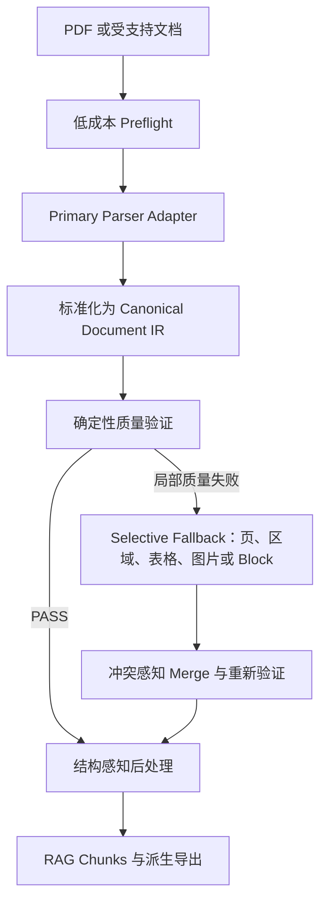
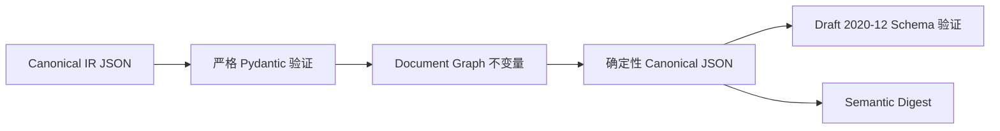

# 企业级文档解析与 RAG 摄取平台

[English](README.md) | [简体中文](README.zh-CN.md)

这是一个面向生产环境的基础项目，目标是把复杂文档转换为版本化、可追踪、与解析器解耦，
并适合后续 RAG 摄取的统一文档表示。

> 当前状态：已完成仓库初始化以及 Canonical Document IR 的 Phase 0–2。
> PDF 解析、OCR、存储、任务编排、质量路由、Fallback 执行和 Chunking 算法尚未实现，
> 这是有意保持的阶段边界。

## 项目定位

目标平台面向 born-digital PDF、扫描件、中文、英文和中英混合文档，恢复文本、版面、阅读顺序、
表格、图片、公式、文档结构以及来源信息。系统的主要输出不是 Markdown，而是稳定的
Canonical Document IR；JSON、Markdown、HTML、RAG Chunk、引用和文档查看器高亮都应由它派生。

目标生产流水线如下：



正常文档只运行一个 Primary Parser。默认情况下，Fallback 只处理失败的实体或页面，而不会让多个
模型重新解析整份文档。

## 当前已实现内容

仓库目前提供纯领域、完全离线的 Canonical IR 基础层：

- 使用 Pydantic v2 的严格模型，启用 `extra="forbid"` 和严格 wire validation。
- 从 Pydantic 模型确定性生成并提交 JSON Schema Draft 2020-12。
- 小写、带类型前缀的 opaque ID，并在 Runtime 和 Schema 中约束 UUIDv5/UUIDv7。
- 左上角原点、PDF point 单位、受限坐标精度、旋转以及可逆仿射变换。
- `DocumentIR`、Page、Block、Unicode TextSpan、处理元数据和 Provenance lineage。
- Section、逻辑/跨页表格、合并单元格、Cell Fragment、Figure、Equation、Reference、
  Relationship 和 Chunk wire entity。
- 文档级引用完整性、拓扑、阅读顺序、表格网格和 Provenance 不变量。
- 确定性的 UTF-8/NFC 序列化、Semantic Digest 和可选 Block Fingerprint。
- 最小、确定性、幂等的 IR Migration Registry。
- Monolithic 与 Sharded IR Packaging Manifest 模型。
- 离线 Unit、Schema、Property-based、Golden Vector 和 CLI 回归测试。

当前实际可执行的流程是：



## 尚未实现

以下内容目前仍是架构契约和实施计划，不是可运行功能：

- 真实 PDF 解析、页面渲染、OCR 或模型推理。
- Docling、PaddleOCR-VL、MinerU、Marker 或 Surya Adapter。
- 本地/S3 Artifact Storage，以及 SQLite/PostgreSQL Job Persistence。
- Parser Worker、GPU 调度、Checkpoint/Resume、Queue 和分布式执行。
- Quality Scoring Engine、Fallback Planning、Fallback Execution 和 Merge Pipeline。
- Semantic Chunk 构建、Token Packing、Embedding、Retrieval 和 Reranking。
- FastAPI 服务、上传接口、Prometheus、OpenTelemetry 和 Grafana 集成。

配置文件中出现的未来 Parser 或 Storage Backend 目前只是经过校验的声明。`doctor` 命令不会初始化
这些系统。

## 核心设计原则

1. **Parser 解耦**：所有 Parser 都必须通过 Adapter 接入；Canonical Model 不导入 Parser SDK，
   也不暴露 Parser 私有对象类型。
2. **Canonical IR First**：结构化、版本化 IR 是唯一事实来源；Markdown 和 RAG Chunk 是派生视图。
3. **Provenance First**：内容可以沿 Chunk、Entity、Block、Page、Geometry、Artifact 和 Parser Run
   追踪回原始来源。
4. **Quality-aware Routing**：Parser 执行成功和解析质量验收是两个不同状态。
5. **Selective Fallback**：默认只允许失败页面或实体进入 Fallback。
6. **优先确定性逻辑**：Schema、Geometry、结构校验、Hash 和路由证据不依赖 LLM。
7. **Simple First, Scalable by Design**：首个部署目标是一台 Linux 主机和一张 NVIDIA GPU；
   只有达到量化迁移条件后才引入扩展组件。

## Canonical Document IR

IR 1.0 的逻辑图如下：

```text
DocumentIR
├── source 与 metadata
├── processing manifest
├── pages[]
│   └── blocks[]
│       └── text_spans[]
├── sections[]
├── tables[]
│   ├── segments[]
│   └── cells[]
│       └── fragments[]
├── figures[]
├── equations[]
├── references[]
├── chunks[]
├── relationships[]
├── provenance[]
└── quality_summary
```

重要 wire contract 包括：

- Schema 版本为 `1.0.0`。
- 文本使用 UTF-8 和 Unicode NFC，不在 Canonical 层做破坏性的检索归一化。
- 时间戳使用 RFC 3339 UTC，并以 `Z` 结尾。
- Digest 格式为 `sha256:<64 位小写十六进制>`。
- Confidence 只能是 `null` 或 `[0, 1]`；未知值绝不能被转换为 `1.0`。
- 页面坐标使用左上角原点、x 向右、y 向下，单位为 PDF point（`1/72 inch`）。
- 已发布内容必须具备可解析的 Provenance。
- Page cardinality、Reading Order、Graph Reference、Table Grid 和 Section Topology 是硬不变量。
- Extension 必须带命名空间且大小受限，不能覆盖 Canonical 语义，也不能承载任意 Parser Raw JSON。

权威契约见 [DOCUMENT_IR_SPEC.md](docs/DOCUMENT_IR_SPEC.md)，生成后的 wire schema 见
[document-ir.schema.json](schemas/document-ir/v1/document-ir.schema.json)。

## 环境要求

- Python 3.12+
- 下方默认命令使用 Windows PowerShell；Linux/macOS 可以运行对应的 Python 命令。
- 当前阶段的安装和默认测试不需要 GPU、模型下载、数据库或网络访问。

## 可复现安装

### Windows PowerShell

```powershell
python -m venv .venv
.\.venv\Scripts\python.exe -m pip install --upgrade pip
.\.venv\Scripts\python.exe -m pip install -r requirements.lock
.\.venv\Scripts\python.exe -m pip install --no-build-isolation --no-deps -e .
```

### Linux 或 macOS

```bash
python3.12 -m venv .venv
.venv/bin/python -m pip install --upgrade pip
.venv/bin/python -m pip install -r requirements.lock
.venv/bin/python -m pip install --no-build-isolation --no-deps -e .
```

当前阶段使用的直接和传递依赖都固定在 [`requirements.lock`](requirements.lock) 中，不会安装
Parser、GPU 或模型依赖。

## 快速验证

```powershell
.\.venv\Scripts\docparser.exe --version
.\.venv\Scripts\docparser.exe doctor --config configs/default.yaml
.\.venv\Scripts\docparser.exe schema check
```

命令职责：

- `--version` 输出 Package Version。
- `doctor` 只验证 Bootstrap YAML Contract，不创建目录、不打开数据库、不加载 Parser，也不访问网络。
- `schema check` 在已提交 JSON Schema 与 Pydantic 生成结果不一致时失败。

## 使用 IR API

可以通过完整代表性 Fixture 查看当前公开契约：

```python
from pathlib import Path

from docparser.ir import (
    dump_canonical_json,
    load_canonical_json,
    semantic_digest,
)

payload = Path(
    "tests/schema/fixtures/positive/full-document.json"
).read_bytes()

document = load_canonical_json(payload)
canonical_bytes = dump_canonical_json(document)

print(document.schema_version)
print(document.page_count)
print(document.tables[0].logical_row_count)
print(semantic_digest(document))
```

`load_canonical_json` 会同时执行严格 wire validation 和文档级 Graph Validation。
`dump_canonical_json` 输出稳定排序、UTF-8 编码且不允许 NaN/Infinity 的 JSON。

## JSON Schema 工作流

Pydantic Model 是权威来源，禁止独立手工编辑已提交的 Schema。

```powershell
# 经过批准的 IR 模型修改后重新生成
.\.venv\Scripts\docparser.exe schema generate

# 检查模型与 Schema 是否漂移
.\.venv\Scripts\docparser.exe schema check
```

CI 会执行 Schema Drift Check。Wire-level Constraint 由 Pydantic 和 JSON Schema 同时保证；
Reference Resolution、Graph Cycle、Table Collision 和 Reading-order Consistency 无法由 JSON Schema
清晰表达，因此由 Domain Validator 保证。

## 配置

[`configs/default.yaml`](configs/default.yaml) 描述了规划中的配置表面：

```yaml
pipeline:
  version: "1.0.0"
  primary_parser: "docling"
  fallback_parsers:
    - "paddleocr_vl"
quality:
  pass_threshold: 0.80
processing:
  max_pages: 1000
  page_parallelism: 4
storage:
  backend: "local"
  path: "./data"
```

Parser 名称只是候选默认值，仍需完成后续 Adapter 实现、Golden Dataset Benchmark、License 审批和
Security Promotion；当前不会实例化它们。

## 仓库结构

```text
.
├── configs/                     # 版本化 Bootstrap Configuration
├── docs/                        # 架构、Specification、Review 与 ADR
│   └── adr/                     # 长期有效的架构决策
├── schemas/document-ir/v1/      # 生成并提交的 Wire Schema
├── src/docparser/
│   ├── cli/                     # 当前 doctor/schema/version 命令
│   └── ir/                      # Canonical IR Domain 与 Serialization
├── tests/
│   ├── schema/                  # Runtime/JSON Schema Parity 与 Fixture
│   └── unit/                    # Domain、Property 和 CLI 测试
├── pyproject.toml
└── requirements.lock
```

## 开发与质量门禁

运行与 CI 相同的检查：

```powershell
.\.venv\Scripts\ruff.exe check .
.\.venv\Scripts\mypy.exe
.\.venv\Scripts\docparser.exe schema check
.\.venv\Scripts\python.exe -m pytest
```

IR Domain Coverage Gate 不低于 85%。默认测试完全离线；标记为 `network` 或 `gpu` 的测试不会进入
默认测试集。

修改 IR Contract 时：

1. 修改权威 Pydantic Model 和对应 Domain Invariant。
2. 添加 Runtime 正向和负向测试。
3. 对 JSON Schema 能表达的规则添加 Schema Parity Test。
4. 重新生成并提交 Schema。
5. 兼容性发生变化时更新 Migration Policy。
6. 评审前运行所有质量门禁。

## 实施路线图

完整的增量计划见 [IMPLEMENTATION_PLAN.md](docs/IMPLEMENTATION_PLAN.md)。每个 Phase 完成后都必须
保持仓库可运行且所有测试通过。

| 状态 | Phase | 范围 |
|---|---|---|
| 已完成 | 0–2 | Bootstrap、可执行 Shell、完整 Canonical IR Graph、Schema、Migration |
| 下一步规划 | 3–5 | 不可变本地 Artifact、SQLite Job State、Parser Port 与 Fake Vertical CLI |
| 已规划 | 6–8 | 安全 PDF Admission、Preflight、第一个 Parser Adapter、多页 Normalization |
| 已规划 | 9–11 | Quality Engine、Selective Fallback、事务式 Merge 与重新验证 |
| 已规划 | 12–14 | RAG Chunking、API/Worker、Observability 与运行加固 |
| 条件实施 | 15–16 | Golden Benchmark/默认方案晋级，以及由量化指标触发的扩展 Adapter |

后续 Phase 的 Interface 或 Configuration 即使已经出现在架构文档中，也不代表功能已经实现。

## 架构文档

建议阅读顺序：

1. [产品规格](docs/PRODUCT_SPEC.md)
2. [系统架构](docs/ARCHITECTURE.md)
3. [Canonical Document IR](docs/DOCUMENT_IR_SPEC.md)
4. [Parser Adapter Contract](docs/PARSER_ADAPTER_SPEC.md)
5. [质量验证](docs/QUALITY_VALIDATION_SPEC.md)
6. [Selective Fallback 与 Merge](docs/FALLBACK_SPEC.md)
7. [RAG Chunk Contract](docs/RAG_CHUNK_SPEC.md)
8. [Storage](docs/STORAGE_SPEC.md)、[API](docs/API_SPEC.md)、
   [Observability](docs/OBSERVABILITY_SPEC.md) 和 [Security](docs/SECURITY_SPEC.md)
9. [Evaluation](docs/EVALUATION_SPEC.md) 与 [Test Strategy](docs/TEST_STRATEGY.md)
10. [反方架构评审](docs/ARCHITECTURE_REVIEW.md)
11. [实施计划](docs/IMPLEMENTATION_PLAN.md)
12. [Architecture Decision Records](docs/adr/)

## 安全边界

未来系统会把每一份上传文档都视为不可信输入。File Admission、MIME Validation、Resource Limit、
Parser Isolation、Temporary File Cleanup、Tenant Isolation 和 Sandbox 已完成规格设计，但尚未实现。
不要把当前仓库直接暴露为文档上传服务，也不要通过临时 Parser Wrapper 处理不可信 PDF。

## 项目纪律

- 业务代码不得依赖 Parser 私有 Schema。
- 未通过 Adapter Contract Test 和 Benchmark Evidence，不得引入或晋级 Parser/Model。
- 禁止手工修改生成的 Schema。
- 禁止静默削弱 Provenance、Compatibility 或 Graph Invariant。
- 在相应 Phase 获得批准前，不得提前引入后续基础设施。

本项目仍在按阶段持续开发。作为生产依赖使用前，请先确认当前实施边界。
