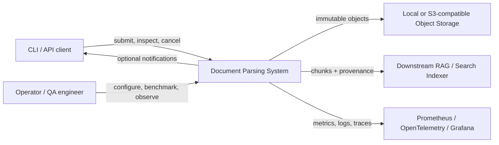
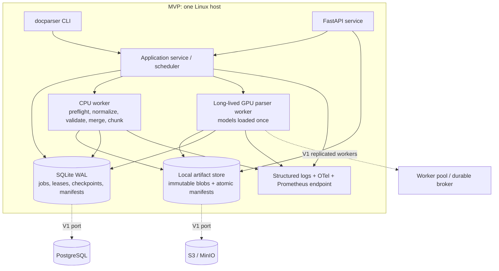
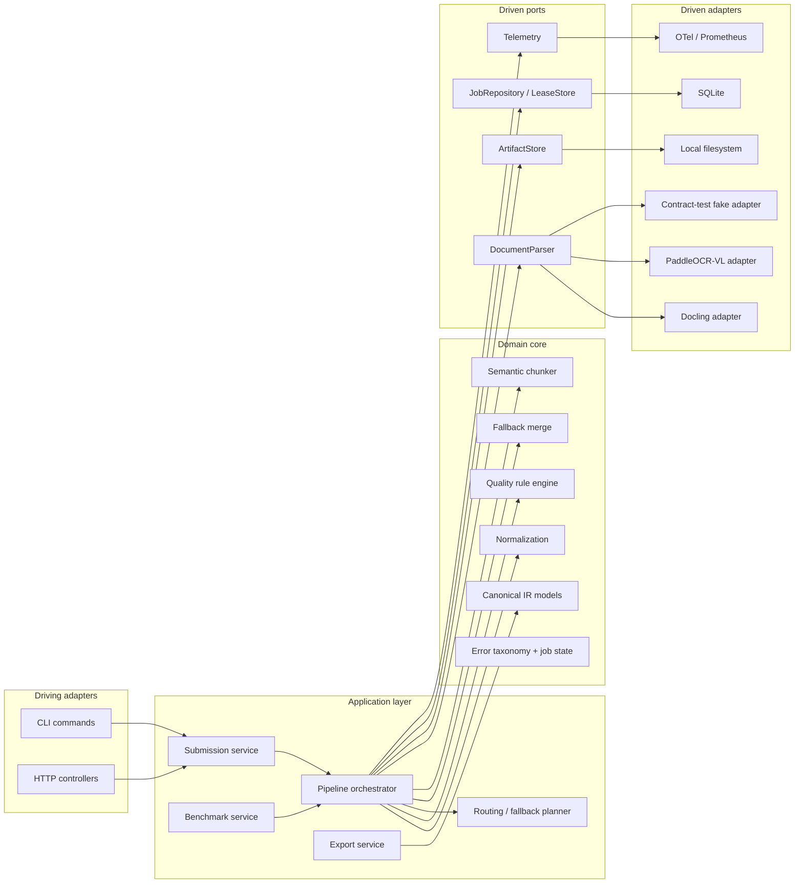
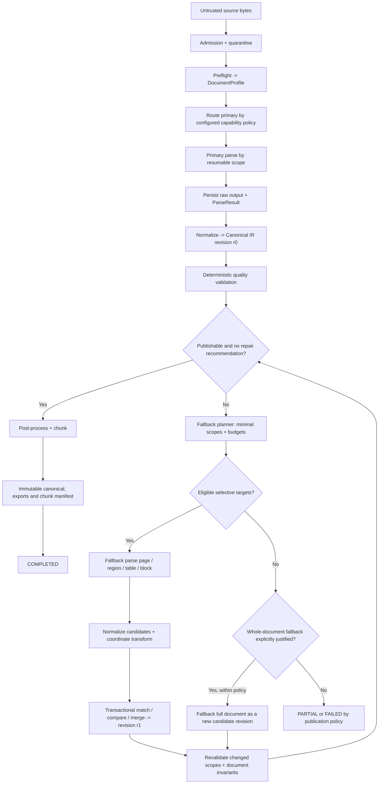
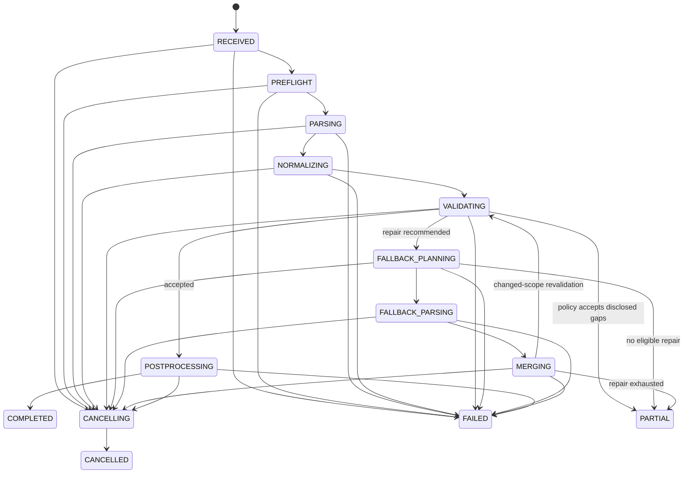

# System Architecture

| Field | Value |
|---|---|
| Status | Proposed |
| Architecture version | 0.1.0 |
| Last updated | 2026-08-28 |
| Deployment baseline | Single Linux host, one NVIDIA GPU, 1–500 pages common, 1000 possible |

## 1. Architectural drivers

The design optimizes, in order, for quality, reliability, provenance, maintainability and observable performance. The principal change boundaries are parser, model, storage backend, quality rules, chunk policy and execution topology. Canonical behavior must remain stable across those changes.

The system uses hexagonal boundaries pragmatically:

- **Domain:** Canonical IR, quality, merge, chunk and job semantics; no infrastructure imports.
- **Application:** pipeline orchestration and use cases against ports.
- **Adapters:** parser integrations, PDF tooling, storage, job store, API/CLI and telemetry.
- **Infrastructure:** vendor libraries, GPU runtimes, filesystem/S3, SQLite/PostgreSQL.

No interface is introduced unless there are at least two plausible implementations, a test seam, or a required change boundary. Parser, blob storage, job/checkpoint store, clock/ID generation and telemetry qualify.

## 2. Context diagram



The downstream RAG system consumes versioned chunks and provenance. It does not consume raw parser output.

## 3. Container diagram



MVP may run API, scheduler and CPU execution in one process, but the boundaries are explicit. Parser libraries run in a separate worker process/container so crashes and unsafe native code do not terminate the API.

## 4. Component diagram



## 5. Pipeline diagram



The loop is bounded by `max_fallback_rounds`, `max_fallback_pages`, `max_fallback_area_ratio`, wall-clock and cost budgets. A second failure with no predicted quality gain terminates; it never cycles indefinitely.

## 6. Data flow and persistence boundaries

1. **Admission:** stream input to a quarantine object while hashing; never trust the filename or request MIME.
2. **Preflight:** read source through a constrained PDF tool and persist `DocumentProfile` plus per-page signals.
3. **Parse:** write raw parser output and rendered inputs as immutable artifacts before acknowledging the stage checkpoint.
4. **Normalize:** create a complete new Canonical IR revision. Raw parser schemas never cross this boundary.
5. **Validate:** persist `QualityReport` separately so thresholds can be retuned without falsifying parser output.
6. **Fallback:** create target manifests, raw results and merge decisions. Merge uses copy-on-write and a baseline revision precondition.
7. **Post-process:** produce chunks/exports as derived, reproducible artifacts keyed by IR revision and component versions.
8. **Commit:** atomically update a small manifest pointer only after artifact checksum verification. Blob writes are immutable.

For large documents, “complete IR revision” is a logical manifest over immutable page/entity JSONL shards. Normalization and export stream shards and keep only bounded indexes/working sets in memory. The monolithic JSON and sharded packaging profiles are lossless views of the same schema, revision IDs and semantic digest; packaging cannot change entity IDs.

Artifacts may exist without a committed manifest after a crash and are garbage-collected only after a grace period. A manifest must never reference an unverified or partially written blob.

## 7. Control flow, ownership and concurrency

- The orchestrator owns state transitions and schedules units; workers never choose the next global state.
- A job has one active lease with fencing token. Expired workers may finish computation but cannot commit after a newer fencing token exists.
- Lease renewal is owned by a supervisor/watchdog independent of a blocking parser call. A call may not exceed the configured non-renewable interval; after cancellation or renewal failure it is terminated at the process-group boundary and the worker context is recycled.
- Units are `document preflight`, `primary page batch`, `normalization batch`, `validation scope`, `fallback target`, `merge transaction`, and `chunk/export batch`.
- Completed unit checkpoints include input artifact digests, output digests, component version/config hash and status. A checkpoint is reusable only when all compatibility keys match.
- GPU workers are long-lived and advertise capabilities, model digests, free VRAM class and supported concurrency. The scheduler applies backpressure instead of oversubscribing VRAM.
- Model residency is explicit. Docling stages and PaddleOCR-VL are not assumed to co-reside on one GPU: a benchmark-approved profile may place primary stages on CPU and reserve GPU for fallback, use separate residency groups with serialized unload/load, or permit co-residency only after peak-VRAM tests. Cold/model-swap time is measured and included in planner cost.
- Page batching is adaptive within configured maxima; outputs retain page identity and are committed individually or as an atomic small batch.
- A batch checkpoint covers only explicit requested scopes whose result cardinality and per-page digests validated. Missing batch members remain incomplete, never implicitly successful.
- CPU work can overlap GPU work only when dependencies permit; bounded queues prevent page images and IR fragments from accumulating without limit.

### Exactly-once effects, at-least-once execution

Execution is at least once. Effects appear exactly once through idempotency keys, immutable object names, conditional manifest commits and fenced job-state transitions. The design does not claim exactly-once computation.

## 8. Preflight design

Preflight uses PDF structure and low-resolution/statistical inspection, never a large model. It emits the following versioned `DocumentProfile`:

| Field | Meaning |
|---|---|
| `profile_version` | Contract version |
| `source_digest`, `file_size_bytes`, `mime_detected` | Identity/admission evidence |
| `pdf_version`, `encrypted`, `linearized`, `parseable` | Container facts |
| `page_count` | Declared/verified page count |
| `pages[]` | width/height points, effective rotation, crop/media boxes |
| `text_layer_ratio`, `scan_ratio`, `image_area_ratio` | Document and per-page density signals |
| `embedded_fonts` | Names/types/embedded flags, sanitized and capped |
| `language_hints` | Fast statistical hints with confidence, not authoritative language classification |
| `document_type` | `BORN_DIGITAL`, `SCANNED`, `MIXED`, `UNKNOWN` |
| `complexity` | `LOW`, `MEDIUM`, `HIGH` from versioned deterministic policy |
| `suspicious_pages[]` | page number, signal codes and routing hints |
| `limits_applied` | renderer DPI, sample count and resource limits |

Detection uses sampled text objects, character counts, image coverage, font presence and low-resolution raster entropy. A page is not marked scanned merely because it contains a background image. Mixed classification is page-aware.

Failure modes:

- Encrypted without an authorized password: non-retryable `INPUT.PDF_ENCRYPTED`.
- Malformed but safely renderable: continue with `profile.parseable=DEGRADED` and force isolated raster route.
- Page count/size/decompression limit exceeded: non-retryable admission error.
- Preflight tool crash/timeout: retry once in a fresh sandbox; then `INPUT.PREFLIGHT_FAILED`.

## 9. Primary and fallback routing

Routing is policy over capabilities and profile, not parser-name conditionals. The config names preferred adapters, while the router asks each adapter for `ParserCapabilities` and validates target compatibility.

Example policy inputs:

- required capabilities (`LAYOUT`, `TABLE`, `OCR`, `FORMULA`);
- source and target scope supported by adapter;
- language and scan support declarations;
- worker/device availability and configured max latency;
- parser deny/allow policy, license approval and model digest;
- per-slice benchmark eligibility.

MVP default candidates are Docling for primary and PaddleOCR-VL for selective fallback. This is a deployable default, not a permanent truth; promotion requires the benchmark and license/security gate in `EVALUATION_SPEC.md`.

Fallback is selected by issue type and target scope. If an adapter lacks native region input, the system renders a clipped region with padding, records the affine transform and calls an image/page capability. This is still a region repair; the adapter must not be allowed to silently parse unrelated pages.

Whole-document fallback requires all of:

- document-wide hard failure or affected area/page ratio above configured threshold;
- selective repair is unsupported or more expensive according to the recorded planner estimate;
- remaining fallback budget allows it;
- planner emits reason code `WHOLE_DOCUMENT_JUSTIFIED`;
- no policy prohibits the chosen parser for this tenant/document.

## 10. Job state machine



### Transition rules

- Terminal states are `COMPLETED`, `PARTIAL`, `FAILED`, `CANCELLED`; they cannot transition in place. Retry/resume creates an attempt under the same job and returns to the last compatible stage through a new `attempt_id`.
- `CANCELLING` is observable. Workers poll cancellation between pages/batches and before commits; hard termination occurs after a grace timeout.
- `PARTIAL` requires a complete page manifest, explicit missing/degraded scopes, a quality report and `allow_partial=true`. It is not a synonym for worker failure.
- Stage progress belongs in checkpoints, not a proliferation of states.
- Every transition is compare-and-set on `(job_id, state_version, lease_fence)` and emits an audit event.

## 11. Unified error taxonomy

Stable error codes use `CATEGORY.CODE`; exception classes are implementation details.

| Category / examples | Retryable | Recoverable from checkpoint | Fatal to job | Default handling |
|---|:---:|:---:|:---:|---|
| `INPUT.INVALID_MIME`, `INPUT.LIMIT_EXCEEDED` | No | No | Yes | Reject |
| `INPUT.PDF_CORRUPT`, `INPUT.PDF_ENCRYPTED` | No | Sometimes | Yes | Reject or authorized password flow |
| `INPUT.UNSUPPORTED_DOCUMENT` | No | No | Yes | Reject |
| `PARSER.TIMEOUT` | Yes | Yes | No until exhausted | Fresh worker, bounded backoff |
| `PARSER.OOM` | Yes | Yes | No until exhausted | Reduce batch/DPI, then alternate adapter |
| `PARSER.CRASH`, `PARSER.UNAVAILABLE` | Yes | Yes | No until exhausted | Replace worker / reroute |
| `PARSER.INVALID_OUTPUT` | No for same version | Yes | Scope fatal | Fallback if eligible |
| `NORMALIZATION.INVALID_COORDINATE` | No for same artifact | Yes | Scope fatal | Reject candidate/fallback |
| `VALIDATION.INVARIANT_FAILED` | No | Yes | Scope/document depends | Repair or fail publication |
| `FALLBACK.NO_CAPABLE_PARSER` | No | Yes | Scope fatal | Partial/fail by policy |
| `FALLBACK.BUDGET_EXHAUSTED` | No | Yes | Scope fatal | Partial/fail |
| `MERGE.CONFLICT`, `MERGE.STALE_BASELINE` | Stale baseline: yes | Yes | No | Re-plan; bounded |
| `STORAGE.TRANSIENT` | Yes | Yes | No until exhausted | Backoff and retry |
| `STORAGE.CHECKSUM_MISMATCH` | Yes once | Yes | Yes if repeated | Re-write from trusted input/quarantine |
| `PIPELINE.CANCELLED` | No | Yes | Terminal by request | Cancel |
| `PIPELINE.INTERNAL` | Conditional | Yes | After retry budget | DLQ + incident |

Every structured error contains `error_code`, `message_safe`, `stage`, `scope`, `retryable`, `recoverable`, `fatal`, `attempt`, `cause_code`, `correlation_id`, and redacted `details`. Original exception text is retained only in protected operator logs.

### Retry policy

- Retry only classified transient failures; exponential backoff with jitter and a wall-clock budget.
- Parser OOM first reduces batch size, then render DPI within quality policy, then changes adapter if recommended. It never loops at the same settings.
- Invalid parser output is deterministic for the same inputs/version and is not retried unchanged.
- DLQ is a **job state/query**, not a separate broker requirement in MVP: exhausted retryable/internal jobs have `dead_lettered_at` and an operator reason.

## 12. Checkpoint and resume protocol

A checkpoint key is:

```text
(document_id, job_id, attempt_stage, unit_scope,
 pipeline_version, component_version, normalized_config_hash,
 input_artifact_digest)
```

Checkpoint record contains output digest(s), page/scope range, lease fence, completion time and validation checksum. Commit order is `write immutable output -> verify digest -> insert checkpoint transaction -> advance job progress`. On resume, the orchestrator scans compatible checkpoints and schedules only missing/invalid units.

For a failure at page 430, pages/batches already committed are reused. Normalization and validation checkpoints are invalidated only for changed source page artifacts and dependent cross-page groups. Chunk checkpoints are invalidated by changed source blocks plus ancestor/neighbor overlap windows, not always the whole document.

## 13. Runtime architecture and scale path

### MVP choice

- FastAPI for service transport; Typer or Click for CLI.
- SQLite in WAL mode for jobs, attempts, leases, idempotency and manifests.
- Local immutable artifact store with atomic rename and checksums.
- One scheduler and one long-lived parser worker process/container; bounded in-memory dispatch backed by durable SQLite work records.
- No Celery, Dramatiq, RQ or Arq in MVP. An external broker would add operations without solving the primary single-host durability requirement.

### Queue evaluation

| Option | Strength | Cost / mismatch | Position |
|---|---|---|---|
| Celery | Mature routing/retry/ecosystem | Heavy configuration; broker/result backend; semantics easy to misuse | V1 candidate only if task graph needs it |
| Dramatiq | Simpler actor model, retries/middleware | Requires Redis/RabbitMQ; fewer workflow primitives | Preferred external-broker candidate |
| RQ | Simple Redis queue | Limited scheduling/routing and GPU placement controls | Suitable for small CPU workloads, not preferred |
| Arq | Async Redis and compact API | Smaller ecosystem; async does not accelerate GPU inference | Not preferred for core GPU jobs |
| SQLite durable scheduler | Minimal ops, transactionally aligned with metadata | Single-host/write-concurrency ceiling | MVP decision |

### V1 migration

1. Replace local blob adapter with S3/MinIO; keep artifact keys and manifests.
2. Migrate SQLite tables to PostgreSQL and use row locking/advisory locks for leases.
3. Run scheduler independently and replicate workers; worker capability heartbeats drive placement.
4. Add Dramatiq/another broker only if measurements show database polling/dispatch is limiting; job truth remains PostgreSQL, not broker messages.
5. Partition queues by resource class (`cpu`, `gpu-small`, `gpu-large`) and model residency; do not encode GPU IDs in domain objects.

Migration is triggered by requirements or sustained measurements, not calendar ambition: any multi-host/high-availability requirement; SQLite busy/lock failures above 0.1% of state transactions; metadata commit P95 above 100 ms for 15 minutes under target load; scheduler/dispatch consuming above 10% of end-to-end processing time; or one logical writer unable to meet the admitted page-equivalent rate. Thresholds are deployment config and must be confirmed by a load test before cutover.

## 14. Database decision

Filesystem-only metadata is rejected because compare-and-set state, idempotency, leases, cancellation and queries require transactions. PostgreSQL is deferred because the MVP has one host and low/medium load. SQLite WAL gives durable transactions, simple backup and a credible schema migration path.

Constraints:

- One logical writer coordinator in MVP; workers submit state changes through repository transactions.
- Busy timeout and short transactions; never hold a DB transaction while parsing or writing a large blob.
- Schema migrations are versioned and forward-only in deployed environments.
- The database stores references/checksums and bounded diagnostics, not large raw parser payloads or page images.

## 15. Configuration and reproducibility

Configuration is loaded from YAML plus environment overrides, validated before admission, secrets resolved separately, and normalized into a hash. Unknown keys are errors.

```yaml
pipeline:
  version: "1.0.0"
  primary_parser: "docling"
  fallback_parsers: ["paddleocr_vl"]
  max_fallback_rounds: 1
quality:
  pass_threshold: 0.80
  fallback_trigger_score: 0.65
  partial_publish_threshold: 0.50
  ruleset_version: "1.0.0"
processing:
  max_pages: 1000
  page_parallelism: 4
  gpu_batch_pages: 4
  checkpoint_pages: 8
  max_fallback_pages: 50
  max_fallback_area_ratio: 0.30
storage:
  backend: "local"
  path: "./data"
jobs:
  backend: "sqlite"
  database_url: "sqlite:///./data/control.db"
security:
  max_file_size_bytes: 536870912
  parser_network: "disabled"
```

Every run records schema, pipeline, normalizer, ruleset, merger, chunker, adapter, parser/model, renderer and configuration versions/digests plus hardware/runtime metadata. `latest` model/image tags are prohibited in reproducible deployments.

## 16. Failure containment

- Admission and PDF rendering execute with file/time/page/pixel/decompression limits.
- Parser worker is non-root, read-only root filesystem, dedicated scratch directory, no host paths or cloud credentials, restricted syscalls and network disabled by default.
- GPU OOM affects one worker lease. Supervisor recycles the worker and its CUDA context; committed checkpoints remain valid.
- Parser raw output is treated as untrusted input to the normalizer: depth, collection length, string and numeric bounds apply.
- Merge is copy-on-write. Validation must pass document invariants before the manifest pointer can advance.
- Export failures do not corrupt Canonical IR and can resume independently.

## 17. Performance design

- Load each model once per warm worker and expose readiness only after a health self-test.
- Render only required pages and cache immutable page rasters by source digest, page, DPI, crop, rotation and renderer version.
- Prefer native PDF text for born-digital content when quality validates; OCR suspicious pages only.
- Bound concurrency by RAM/VRAM estimates and measured feedback; page parallelism is not assumed equal to GPU batch size.
- Spill raw/IR artifacts to object storage instead of retaining full 1000-page documents in memory.
- Backpressure admission and scheduling using queued page-equivalents and estimated pixels/tokens, not only job count.
- Measure cold start separately from warm steady-state.

## 18. Repository structure

```text
.
├── pyproject.toml
├── configs/
│   ├── default.yaml
│   └── schemas/
├── docs/
│   ├── adr/
│   └── *.md
├── schemas/
│   └── document-ir/v1/
├── src/docparser/
│   ├── domain/            # IR-independent job/error/value semantics
│   ├── ir/                # Canonical models, migrations, JSON Schema export
│   ├── application/       # use cases and orchestrator
│   ├── preflight/
│   ├── normalization/
│   ├── quality/
│   ├── fallback/
│   ├── chunking/
│   ├── ports/             # parser/storage/job/telemetry protocols
│   ├── adapters/
│   │   ├── parsers/
│   │   ├── storage/
│   │   ├── jobs/
│   │   └── telemetry/
│   ├── api/
│   ├── cli/
│   └── worker/
├── tests/
│   ├── unit/
│   ├── contract/
│   ├── integration/
│   ├── failure_injection/
│   ├── schema/
│   └── golden/
└── tools/benchmark/
```

`domain` does not import FastAPI, SQLite, cloud SDKs or parser packages. Parser-specific packages and schemas remain under `adapters/parsers/<name>`.

## 19. Future coding standards

- Python 3.12+, complete type hints, pyright/mypy compatibility, Ruff and pytest.
- Dependency injection at application composition roots; no service locator or mutable hidden global state.
- Structured errors and logging; no `except Exception: pass`.
- Prefer pure functions for normalization, scoring, matching, merging and chunk planning.
- Async only for real concurrent I/O. CPU/GPU work runs in controlled processes, not on the API event loop.
- Composition over inheritance; Protocols at true boundaries.
- Parser-specific conditions are adapter configuration/mapping, never application `if parser_name == ...` branches.
- Config comes from validated files/environment; no operational constants embedded in algorithms.

## 20. Cross-spec ownership

| Concern | Authoritative spec |
|---|---|
| Canonical entities, coordinates, IDs, provenance | `DOCUMENT_IR_SPEC.md` |
| Parser contracts and selection evidence | `PARSER_ADAPTER_SPEC.md` |
| Rule/scoring semantics | `QUALITY_VALIDATION_SPEC.md` |
| Target planning and merge algorithm | `FALLBACK_SPEC.md` |
| Chunk semantics | `RAG_CHUNK_SPEC.md` |
| Object layout and storage ports | `STORAGE_SPEC.md` |
| HTTP contract | `API_SPEC.md` |
| Logs/metrics/traces | `OBSERVABILITY_SPEC.md` |
| Benchmark and regression gates | `EVALUATION_SPEC.md` |
| Trust boundaries | `SECURITY_SPEC.md` |
| Test pyramid and contracts | `TEST_STRATEGY.md` |
