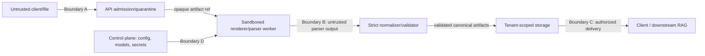

# Security Specification

| Field | Value |
|---|---|
| Status | Proposed threat model and controls |
| Primary threat | Untrusted documents exercising complex native/render/model dependencies |

## 1. Assets and trust boundaries

Protected assets: original documents, extracted text/images/tables, Canonical IR/chunks, tenant metadata, credentials/keys, model artifacts, GPU/host availability and audit history.



No boundary trusts the previous layer merely because it is internal. Parser raw output is untrusted structured input; exported HTML/image content is potentially active content.

## 2. Threats

- malformed PDF parser/render vulnerabilities and native-code memory corruption;
- decompression/image/pixel/object-count bombs, extreme coordinates, recursive structures and infinite loops;
- encrypted/polyglot/spoofed MIME files;
- path traversal, unsafe filenames, symlink/reparse attacks and temp-file leakage;
- SSRF/model download/plugin loading and data exfiltration through network-capable workers;
- GPU/CPU/RAM/disk exhaustion and noisy-neighbor denial of service;
- malicious parser output with deep JSON, huge strings, NaN/Infinity or forged provenance;
- cross-tenant ID/reference/cache/deduplication leakage;
- unauthorized artifact URL/download and telemetry/log leakage;
- compromised dependencies/models/containers or mutable `latest` tags;
- stored XSS through HTML/SVG/Markdown exports;
- prompt injection if optional LLM enrichment is introduced later.

## 3. Admission controls

1. Stream upload; enforce compressed/source byte limit while hashing. Do not buffer whole input in API memory.
2. Sanitize display filename; storage paths use opaque IDs only.
3. Detect MIME from magic/signature and PDF structure; request `Content-Type` is advisory.
4. Reject polyglot/unsupported inputs by policy. Do not auto-unzip archives in PDF endpoint.
5. Preflight in a constrained process checks encryption, page count, dimensions, object/stream counts where available and safe renderability.
6. Enforce configurable limits before expensive parsing:

```yaml
max_file_size_bytes: 536870912
max_pages: 1000
max_page_dimension_points: 20000
max_render_pixels_per_page: 100000000
max_total_render_pixels: 10000000000
max_pdf_objects: 5000000
max_parser_raw_bytes: 1073741824
max_ir_entities: 5000000
max_wall_time_seconds: 21600
```

These are starting ceilings, not promises. Effective limits may be lower by tenant/deployment. Estimated expansion triggers quota reservation/backpressure.

Encrypted PDFs are rejected unless a later authorized password flow securely supplies a secret to the sandbox; passwords are never stored in IR/logs/config hashes.

## 4. Parser/render sandbox

MVP production target is a dedicated container/process per worker role with:

- non-root UID/GID, no privilege escalation, dropped Linux capabilities;
- read-only root filesystem and per-job scratch volume with size quota;
- no host filesystem mounts except explicit read-only model cache and scoped artifact channel;
- no cloud/service credentials in parser environment;
- outbound network disabled; inbound limited to controlled local IPC if needed;
- seccomp/AppArmor/SELinux profile where platform supports it;
- PID, file descriptor, process, CPU, RAM, scratch, wall-time and output limits;
- GPU device limited to assigned worker; model process recycled after OOM/crash or policy count;
- renderer/parser dependencies patched and scanned.

A stronger microVM sandbox may replace the container for higher-risk tenants without changing application contracts. On systems where GPU isolation cannot be made sufficiently strong, separate GPU host/tenant pools are required.

Workers write only through assigned artifact writers. They cannot select arbitrary output paths. Model loading occurs before readiness from an allow-listed, digest-verified local cache; request-time code/model downloads are prohibited.

## 5. Safe intermediate processing

- Render dimensions/pixel counts are checked before allocating images.
- Parser subprocess timeout kills the process group, then supervisor recreates a clean worker/context.
- Raw output parser enforces max bytes, depth, collection/string sizes, finite numbers and schema.
- Images are decoded/re-encoded in the sandbox when safe; metadata is stripped according to preservation policy.
- External PDF actions, JavaScript, embedded files, launch actions, URLs and attachments are never executed/fetched.
- Fonts are parsed only by patched sandboxed libraries; embedded filenames do not become paths.
- Scratch files use randomized names, restrictive permissions and no shared tenant directory; cleanup is supervised after crashes.

## 6. Tenant isolation and authorization

- Tenant ID is supplied by authenticated context, never trusted from body/path alone.
- Every database query/artifact access includes tenant ownership.
- Document IDs are opaque and unguessable; authorization still does not depend on opacity.
- Cache keys and deduplication include tenant/policy namespace. Cross-tenant content deduplication is disabled by default because digest side channels and retention differ.
- Worker dispatch carries scoped artifact capabilities, not general bucket credentials.
- Per-tenant active jobs, pages, bytes, GPU time and retention quotas limit noisy neighbors.
- Raw artifacts and diagnostics require elevated role beyond normal derived-output read.

MVP single-host isolation is logical plus filesystem permissions/container boundaries; it is not suitable for mutually hostile tenants without deployment hardening and threat-model review.

## 7. Storage and delivery

- TLS for API/object traffic; encryption at rest for service deployments.
- Secrets/keys live in platform secret provider/environment injection, not YAML, database diagnostics or IR.
- Immutable source/canonical artifacts have SHA-256 and verified metadata.
- Signed download URLs are short-lived, actor-authorized and never logged.
- Downloads set safe `Content-Type`, `Content-Disposition: attachment`, `X-Content-Type-Options: nosniff` and restrictive CSP where displayed.
- HTML/SVG are considered active. Serve as attachment or sanitize through a versioned sanitizer before inline viewer use.
- Deletion is policy/audit controlled and includes intermediates/backups according to documented retention.

## 8. API and control-plane security

- Authentication mechanism is deployment-specific; authorization scopes are defined in `API_SPEC.md`.
- Rate limit and quota by tenant/actor plus global backpressure.
- Idempotency keys are bounded opaque strings and cannot cross tenant boundaries.
- Validate all JSON/YAML with strict schemas; unknown config keys fail.
- Normal tenant API cannot set parser name, model path, inference URL, prompt, local path or arbitrary adapter options.
- Administrative pipeline/model changes require separate role, audit event and approved manifest.
- Operational metrics/health endpoints are not exposed publicly.
- CORS is deny/default allow-list; CSRF protections apply if browser cookie auth is later used.

## 9. Supply-chain and model security

- Pin dependencies and container base images by version/digest; generate SBOM.
- Verify package/model/container checksums and provenance/signatures where available.
- Scan OS/Python dependencies and images; define severity remediation policy and exceptions with expiry.
- Maintain license inventory separately for code, model weights, datasets and transitive components.
- Models are allow-listed with immutable digest, source, license approval, safety scan and benchmark approval.
- Disable arbitrary pickle/loading of untrusted model formats where safer formats are available; model caches are read-only at runtime.
- Rebuild/promotion process produces rollback-capable immutable images. Never deploy `latest` tags.

## 10. LLM and remote service policy

Core pipeline has no external LLM dependency. Any future remote parser/LLM adapter requires:

- explicit tenant opt-in and data-processing/legal approval;
- egress allow-list, authentication secret isolation and request/response size limits;
- no source retention/training contract assumption without proof;
- prompt-injection treated as untrusted content; documents cannot choose tools, URLs, model/config or system actions;
- provenance labels `VLM`/remote parser and separate cost/availability policy;
- deterministic local fallback for mandatory integrity checks.

Remote semantic output cannot bypass schema, provenance or quality validation.

## 11. Audit, privacy and incident response

- Audit submission/download/delete/reprocess/cancel/retry, raw-artifact access and config/model changes.
- Operational logs exclude document content and secret-bearing values; canary redaction tests run in CI.
- Document classifications drive retention and telemetry access.
- Security rejection exposes safe stable error codes, while detailed evidence remains restricted.
- Preserve malicious samples only in isolated security corpus with access/retention approval.
- Incident runbooks cover suspected parser exploit, model compromise, cross-tenant access, artifact integrity failure and resource-exhaustion attack.
- Ability to disable an adapter/model digest immediately without schema/application deployment is required.

## 12. Security test plan and release gates

- malformed/corrupt/encrypted/polyglot PDF corpus and fuzzing for admission/preflight/normalizer;
- decompression/pixel/object/deep-JSON/huge-string resource-limit tests;
- parser timeout, fork bomb/process group and scratch/disk exhaustion tests in controlled environment;
- path traversal, symlink/reparse, alternate data stream and unsafe filename tests;
- SSRF/network egress denial/model-download prohibition tests;
- tenant IDOR/cache/deduplication/idempotency isolation tests;
- stored XSS/content-type/download-header tests;
- secret/text leakage tests for logs, metrics, traces and error responses;
- dependency/container/model SBOM, signature/digest, vulnerability and license gates;
- restore/deletion/legal-hold exercises.

Critical sandbox escape, cross-tenant read/write, broken provenance integrity, unsigned/unapproved model or high-severity unmitigated dependency issue blocks production promotion.

## 13. Residual risks

- GPU device/driver attack surface is shared with the host; container isolation is not a VM boundary.
- Native PDF/render libraries may have unknown vulnerabilities.
- Single-host MVP has lower tenant and availability isolation than a distributed deployment.
- Model weights may contain behavioral failures that deterministic validators do not detect.

Mitigation is defense-in-depth, patching, isolation, quotas, provenance, benchmark coverage and a documented path to dedicated hosts/microVMs—not a claim that PDF parsing is safe by default.

